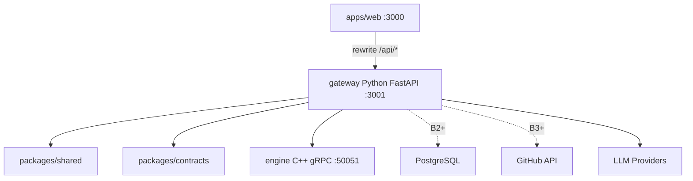

# PRism 功能实现计划

本文档描述 PRism（Reviewly Monorepo）从产品 MVP 到完整工程质量平台的实施路线，涵盖前端（`apps/web`）、Python 网关（`services/gateway`）、C++ 分析引擎（`services/engine`）与共享契约（`packages/shared`、`packages/contracts`）。

## 文档说明

| 应用 | 路径 | 端口 | 职责 |
|------|------|------|------|
| Web 前端 | `apps/web` | 3000 | UI、API client、hooks；通过 rewrite 访问网关 |
| API 网关 | `services/gateway` | 3001 | **唯一 REST 入口**；DB、GitHub、AI 代理、任务编排 |
| 分析引擎 | `services/engine` | 50051 (gRPC) | diff 解析、规则扫描、依赖图、评分聚合 |
| 共享类型 | `packages/shared` | — | 前端 TypeScript 领域类型 |
| 契约 | `packages/contracts` | — | OpenAPI + protobuf 单一来源 |

- Web 的 `next.config.mjs` 将 `/api/*` 代理到 `API_URL`（默认 `http://localhost:3001`）。
- **业务 API 一律在 `services/gateway` 实现**；C++ 仅通过 gRPC 被网关调用。
- **当前已实现**：`POST /api/ai/chat`（Python）；B0 mock REST；B1 分析 job（内存）；引擎 gRPC stub。



## 技术栈

| 层级 | 技术 |
|------|------|
| 前端 | Next.js 16、React 19、TypeScript、Tailwind CSS 4 |
| 网关 | Python 3.11+、FastAPI、Pydantic v2、SQLAlchemy 2、Alembic、httpx |
| 引擎 | C++20、CMake 3.20+、gRPC、protobuf |
| 数据库 | PostgreSQL 16（B2+） |
| 契约 | OpenAPI 3.1、`packages/contracts/proto` |

**已废弃**：`apps/api`（Next.js TypeScript API）、Prisma。

## 目标

将当前静态前端演示升级为可用的 AI Pull Request 智能评审平台，支持仓库接入、PR 同步、diff 展示、AI 分析、安全/性能/架构风险识别、治理规则和团队质量分析。

---

## 服务职责边界（Python vs C++）

| 能力 | Python `gateway` | C++ `engine` |
|------|------------------|--------------|
| REST / 校验 / 错误格式 | 是 | 否 |
| Mock/CRUD、GitHub、DB、settings 加密 | 是 | 否 |
| `POST /api/ai/chat` | 是 | 否 |
| Job 状态机、持久化、LLM 编排 | 是 | 参与计算 |
| patch → `DiffFile[]` | 调用 engine | **实现** |
| chunk 切分、规则扫描 | 调用 engine | **实现** |
| 依赖图 / 架构 impact | 调用 engine | **实现** |
| riskScore、结构化 findings 聚合 | 落库 | **实现** |
| LLM prompt / Provider 调用 | **实现** | 否 |
| 合并规则 findings + LLM findings | **实现** | 提供结构化输出 |

**对内协议**：gRPC `proto/prism/v1/engine.proto` — `ParseDiff`、`RunAnalysis`（server stream）、`BuildDependencyGraph`、`HealthCheck`。

**降级**：`PRISM_STUB_ENGINE=1` 或引擎不可达时，网关使用内存 stub（与 B1 seed 一致）。

---

## 契约单一来源

| 产物 | 路径 | 消费方 |
|------|------|--------|
| OpenAPI | `packages/contracts/openapi/prism-v1.yaml` | 文档、可选 codegen |
| protobuf | `packages/contracts/proto/prism/v1/*.proto` | gateway（grpcio）、engine（CMake） |
| TS 类型 | `packages/shared/src/types/*.ts` | `apps/web`（B2 前手工对齐，之后 openapi-typescript） |

**破坏性变更**：先改 OpenAPI/proto → 同步 `packages/shared` → 再改 gateway 与 web。

---

## 后端现状

| 模块 | 状态 |
|------|------|
| `services/gateway` AI、`B0` mock REST、`B1` job | 已实现 |
| `services/engine` gRPC stub + `ParseDiff` 基础 | 已实现（可 `cmake --build`） |
| `alembic` / PostgreSQL | 脚手架（B2 迁移待接路由） |
| GitHub App | 模块占位（B3） |
| B5–B10 领域 API | 路由占位 + seed 过滤 |

---

## 目录规范

### Python `services/gateway`

```
services/gateway/
├── pyproject.toml
├── app/
│   ├── main.py
│   ├── core/           # config, errors
│   ├── api/v1/         # REST routers
│   ├── mock/seed.py
│   ├── ai/             # LLM 多 Provider
│   ├── services/       # analysis_jobs, settings_store
│   ├── db/             # SQLAlchemy models
│   ├── github/         # B3
│   └── grpc_client/    # engine 客户端 + stub
├── alembic/
└── tests/
```

### C++ `services/engine`

```
services/engine/
├── CMakeLists.txt
├── proto/              # 链到 packages/contracts/proto
└── src/
    ├── server/
    ├── diff/
    ├── chunking/
    ├── rules/
    ├── graph/
    └── scoring/
```

---

## 迁移里程碑

| 里程碑 | 内容 | 状态 |
|--------|------|------|
| M0 | Python `POST /api/ai/chat`；删除 `apps/api` | 完成 |
| M1 | B0 mock REST + OpenAPI 初稿 + Web `lib/api` | 完成 |
| M2 | C++ engine stub + B1 job gRPC 连通 | 完成 |
| M3 | B2 Alembic + B3 GitHub + C++ `ParseDiff` 生产化 | 进行中 |
| M4 | B4 全引擎 + LLM pipeline | 待开始 |

---

## 后端路线图（B0–B10，双轨）

### B0：Mock REST（对齐 P0）

| 轨 | 任务 |
|----|------|
| **Py** | `mock/seed.py`；`GET dashboard/repos/pull-requests/.../diff/security/settings`；`PATCH settings` |
| **Cpp** | 可选 `HealthCheck` |
| **Web** | `src/lib/api/*`、`hooks`；逐步替换组件内 mock import |

**验收**：Network 可见 B0 请求；`apps/api` 已移除。

### B1：PR 分析闭环（对齐 P1）

| 轨 | 任务 |
|----|------|
| **Py** | `POST .../analysis`、`GET jobs/:id`、`GET findings`、`analysis/latest`；findings → diff `riskComment` |
| **Cpp** | `RunAnalysis` stub：progress 流 + seed findings |
| **Py** | B1 不调 LLM |

### B2：PostgreSQL（对齐 P2）

| 轨 | 任务 |
|----|------|
| **Py** | Alembic；`repositories/*`；`docker-compose.yml` Postgres |
| **Cpp** | 无状态，无 DB |

### B3：GitHub（对齐 P3）

| 轨 | 任务 |
|----|------|
| **Py** | App JWT、install/callback、webhook、sync |
| **Cpp** | **`ParseDiff`** 生产级 patch → `DiffFile[]` |

### B4：AI + 分析引擎（对齐 P4）

| 轨 | 任务 |
|----|------|
| **Cpp** | chunking、rules、scoring、`RunAnalysis` 完整实现 |
| **Py** | `analysis/pipeline.py`：engine → per-chunk LLM → 合并落库 |

### B5–B8：领域 API（对齐 P5–P8）

| 阶段 | Python | C++ |
|------|--------|-----|
| B5 安全 | CRUD + stats | CWE 规则扩展 |
| B6 性能 | 列表/统计 | 性能启发式 |
| B7 架构 | REST 图数据 | `BuildDependencyGraph` |
| B8 治理 | rules/violations/audit | 规则求值可下沉 engine |

### B9–B10：团队与设置（对齐 P9–P10）

全部 **Python**；B10：`SETTINGS_ENCRYPTION_KEY` AES 存储 API Key，响应脱敏。

---

## 环境变量（gateway）

| 变量 | 阶段 | 说明 |
|------|------|------|
| `DATABASE_URL` | B2+ | PostgreSQL |
| `ENGINE_GRPC_ADDR` | B1+ | 默认 `localhost:50051` |
| `PRISM_STUB_ENGINE` | dev | `1` 时不连 C++ |
| `GITHUB_APP_ID` | B3+ | GitHub App |
| `GITHUB_APP_PRIVATE_KEY` | B3+ | PEM |
| `GITHUB_WEBHOOK_SECRET` | B3+ | Webhook 验签 |
| `APP_URL` | B3+ | 回调基址 |
| `SETTINGS_ENCRYPTION_KEY` | B10+ | 32 字节 hex |
| `API_URL` | — | 仅 web rewrite 使用 |

本地：`docker compose up -d` → `cd services/gateway && alembic upgrade head` → `uvicorn app.main:app --port 3001`。

引擎：`cd services/engine/build && cmake .. && cmake --build .`（Windows 建议 vcpkg 安装 `grpc` `protobuf`）。

---

## 横切关注点

1. **错误码**：400 校验、404 不存在、409 job 冲突、502 LLM/引擎失败、503 引擎不可用
2. **分页**：`cursor` + `limit`
3. **日志**：结构化；禁止记录完整 apiKey
4. **任务队列**：B1 内存；B4+ 可选 Redis/Celery
5. **测试**：`pytest` + `httpx`；C++ `ctest`

---

## 与前端协作边界

| 产品阶段 | 前端 | 后端 |
|----------|------|------|
| P0 | `lib/api`、hooks、URL 导航 | B0 |
| P1 | job 轮询 | B1 |
| P2+ | 不改组件结构 | B2+ |

---

## P0：前端 API 化与导航基础

> **后端**：B0

### 1. 共享类型

扩展 `packages/shared`：`Repository`、`PullRequest`、`AnalysisJob`、`AnalysisFinding`、`DashboardStats`、`PrismSettings` 等（见 `types/api.ts`）。

### 2. API client

`apps/web/src/lib/api/`：`client.ts`、`dashboard.ts`、`pull-requests.ts`、`analysis.ts` 等。

### 3. Hooks

`apps/web/src/hooks/`：`use-dashboard.ts`、`use-pull-requests.ts` 等。

### 4. URL 导航

`/?view=dashboard`、`/?view=ai-review&prId=2847` 等（`navigation-context.tsx`）。

### P0 验收标准

- Network 可见数据 API；刷新保留 view；mock 可换 DB 不改 UI。

---

## P1：PR 评审核心闭环

> **后端**：B1

`POST .../analysis` → 轮询 `GET .../jobs/:id` → `analysis/latest` + findings + diff comments。

### P1 验收标准

- 列表进详情；分析进度来自 API；完成后 summary/findings 一致。

---

## P2：数据库持久化

> **后端**：B2

PostgreSQL + SQLAlchemy + Alembic（非 Prisma）。核心表见附录 B。

### P2 验收标准

- 重启不丢数据；settings 持久化。

---

## P3：GitHub 集成

> **后端**：B3（Py）+ `ParseDiff`（Cpp）

安装 App → 同步仓库/PR → webhook。

### P3 验收标准

- 真实 open PR；webhook upsert。

---

## P4：AI 分析引擎

> **后端**：B4

Python `ai/` + `analysis/pipeline.py`；C++ `RunAnalysis` 全量。

### P4 验收标准

- 结构化 findings；merge 建议；失败可重试。

---

## P5–P10

| 阶段 | 前端 | 后端 |
|------|------|------|
| P5 安全 | `SecurityView` + hooks | B5 |
| P6 性能 | `PerformanceView` | B6 |
| P7 架构 | `ArchitectureView` | B7 |
| P8 治理 | `GovernanceView` | B8 |
| P9 团队 | `TeamView` | B9 |
| P10 设置 | `SettingsView` | B10（服务端加密 Key） |

---

## 推荐实施顺序

| 顺序 | 工作 |
|------|------|
| 1 | M0 + M1（已完成） |
| 2 | P0/P1 前端接 hooks + B0/B1 |
| 3 | M2 engine stub |
| 4 | M3 B2→B3 |
| 5 | M4 B4 → P5–P10 / B5–B10 |

---

## 附录 A：API 总表

| 方法 | 路径 | 阶段 | 实现方 | 状态 |
|------|------|------|--------|------|
| POST | `/api/ai/chat` | — | gateway | 已实现 |
| GET | `/api/dashboard` | B0 | gateway | 已实现 |
| GET | `/api/repos` | B0 | gateway | 已实现 |
| GET | `/api/pull-requests` | B0 | gateway | 已实现 |
| GET | `/api/pull-requests/:id` | B0 | gateway | 已实现 |
| GET | `/api/pull-requests/:id/diff` | B0 | gateway | 已实现 |
| GET | `/api/pull-requests/:id/analysis/latest` | B0/B1 | gateway | 已实现 |
| POST | `/api/pull-requests/:id/analysis` | B1 | gateway | 已实现 |
| GET | `/api/pull-requests/:id/findings` | B1 | gateway | 已实现 |
| GET | `/api/analysis/jobs/:jobId` | B1 | gateway | 已实现 |
| GET | `/api/security/findings` | B0 | gateway | 已实现 |
| GET/PATCH | `/api/settings` | B0 | gateway | 已实现 |
| POST | `/api/repos/sync` | B3 | gateway | 占位 |
| GET | `/api/integrations/github/install-url` | B3 | gateway | 占位 |
| POST | `/api/webhooks/github` | B3 | gateway | 占位 |
| GET | `/api/governance/rules` | B8 | gateway | 占位 |
| GET | `/api/team/members` | B9 | gateway | 占位 |
| POST | `/api/settings/test-integration` | B10 | gateway | 占位 |

完整路径列表随 OpenAPI 维护：`packages/contracts/openapi/prism-v1.yaml`。

---

## 附录 B：SQLAlchemy 核心实体

与历史 ER 一致，ORM 在 `services/gateway/app/db/models.py`：

- `teams`、`users`、`repositories`、`pull_requests`、`pull_request_files`
- `analysis_jobs`、`analysis_findings`、`review_comments`
- `governance_rules`、`governance_violations`、`audit_logs`
- `settings`（JSON + 加密字段 B10）

迁移：`alembic revision --autogenerate` → `alembic upgrade head`。

---

## 附录 C：关键代码锚点

| 能力 | 路径 |
|------|------|
| AI 代理 | `services/gateway/app/api/v1/ai.py` |
| Mock seed | `services/gateway/app/mock/seed.py` |
| 分析 job | `services/gateway/app/services/analysis_jobs.py` |
| 引擎客户端 | `services/gateway/app/grpc_client/engine.py` |
| gRPC 服务 | `services/engine/src/server/main.cpp` |
| Diff 解析 | `services/engine/src/diff/parser.cpp` |
| 共享类型 | `packages/shared/src/types/prism.ts` |
| Web API client | `apps/web/src/lib/api/client.ts` |

---

## 附录 D：gRPC 消息（engine.proto）

**ParseDiffRequest**：`patch` (string)、`base_path` (optional)

**ParseDiffResponse**：`files` — 与 `DiffFile` JSON 同构

**AnalysisInput**：`job_id`、`pull_request_id`、`patch`、`file_paths[]`、`options`（ignore_lockfiles、max_chunk_lines）

**AnalysisProgress**（stream）：`status`、`progress`、`chunk_index`、`chunk_total`、`findings[]`（partial）

**DependencyGraphRequest**：`repo_id`、`snapshot_ref`

**DependencyGraphResponse**：`nodes[]`、`edges[]`

字段细节以 `packages/contracts/proto/prism/v1/engine.proto` 为准。
